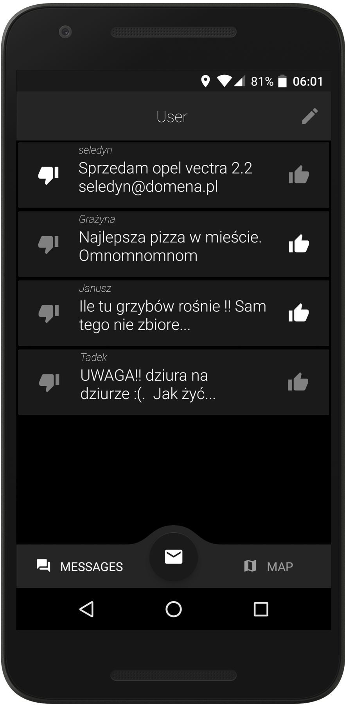
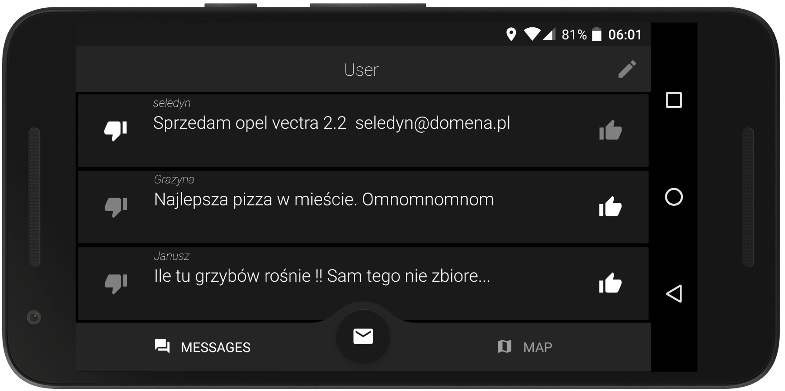
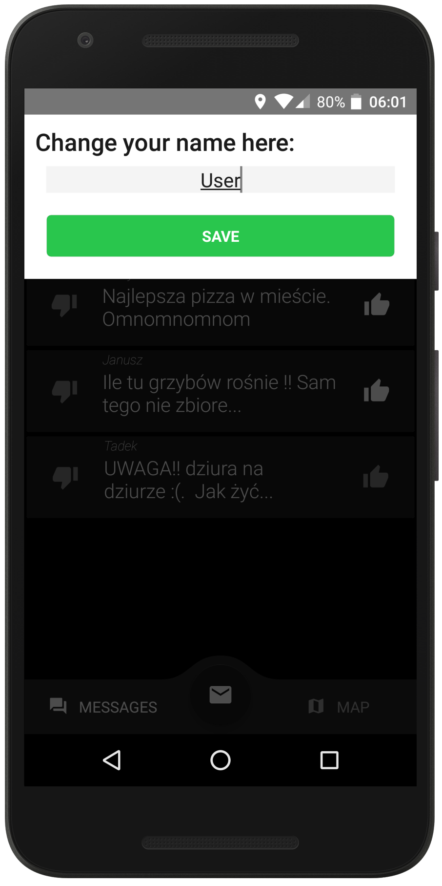
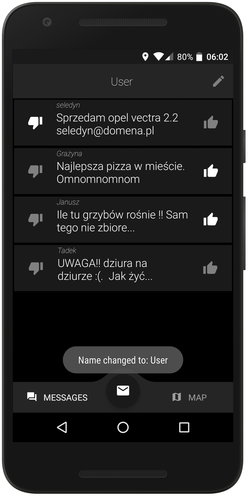
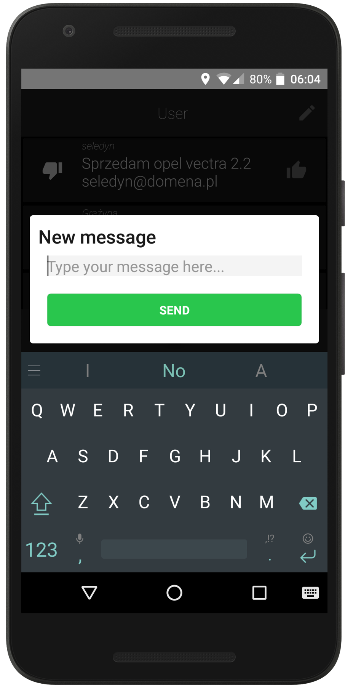
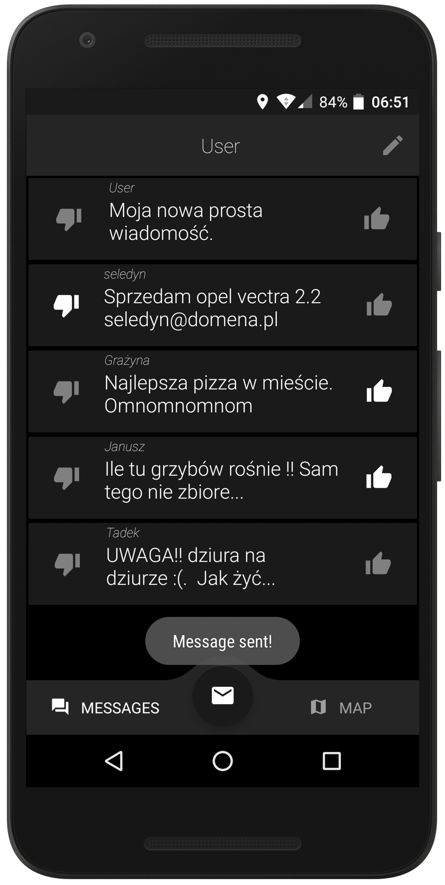
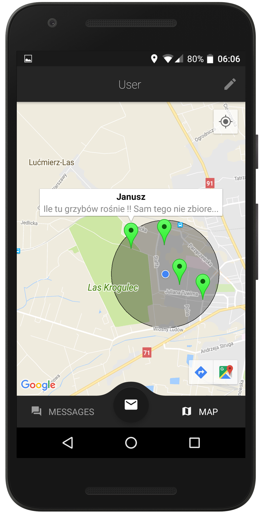
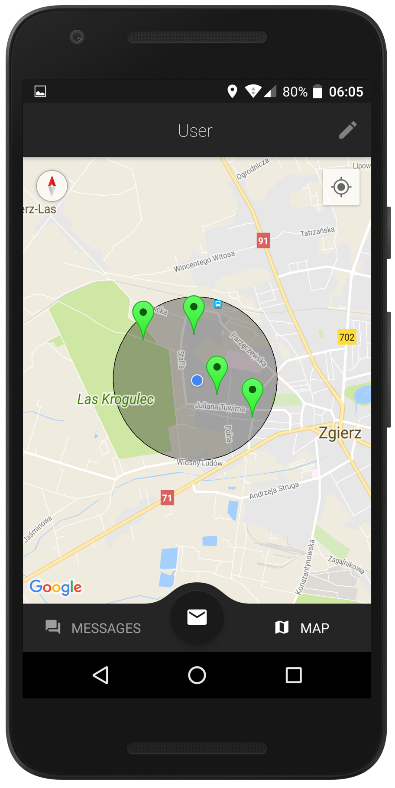

# Ghostssip 👻

This app allows you to leave a geolocated message with a limited lifespan. Users can `down/up`-vote a particular message and that's how its lifspan is `decreased/extended`. Users can view and interact only with messages that are near by.

I'm writing this readme only to have the final result kept somewhere. It was my first project that I was really proud of.

## Preview

  
  

  
  

  
  

  
  

## Setup

Requires backend! Originally it was based on simple php server and MySQL Database which I served locally, and never deployed it anywhere else. Both are lost somewhere now, but it shouldn't be hard to reproduce if needed.

## License

© 2018 Błażej Lewandowski
